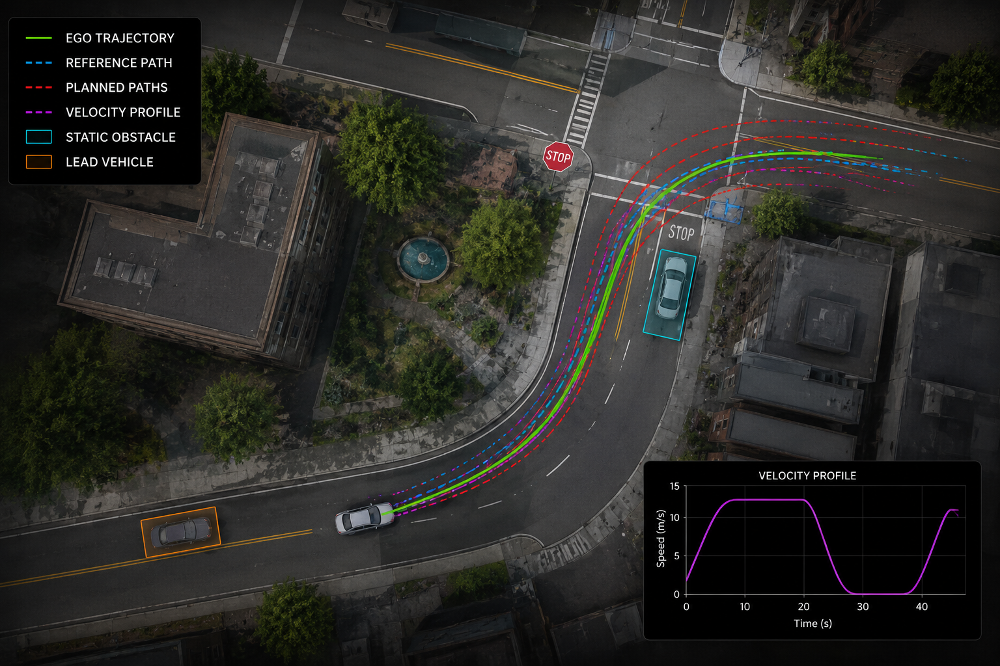
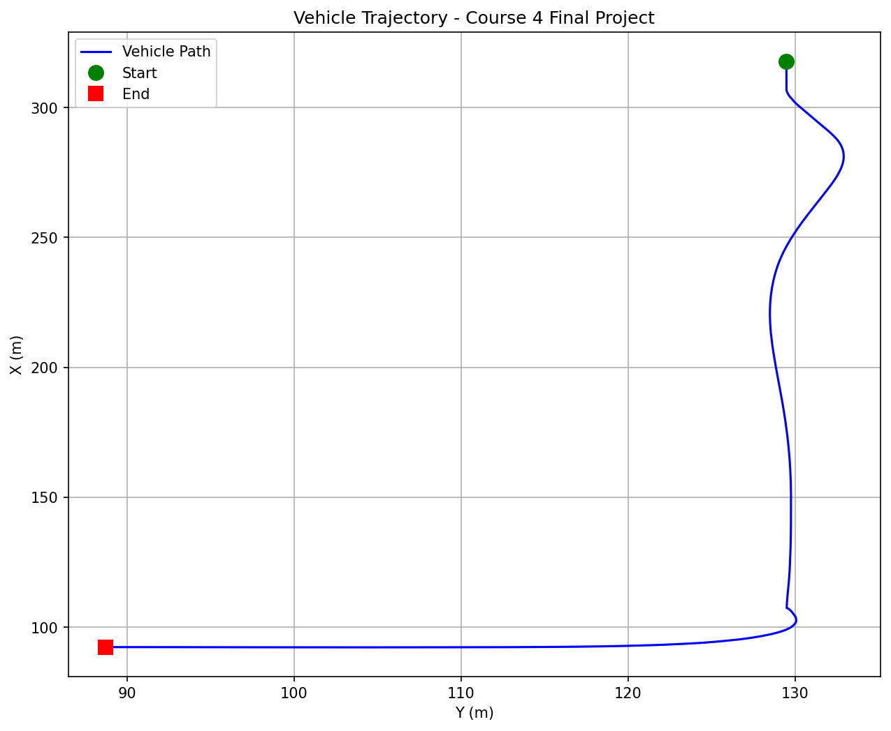
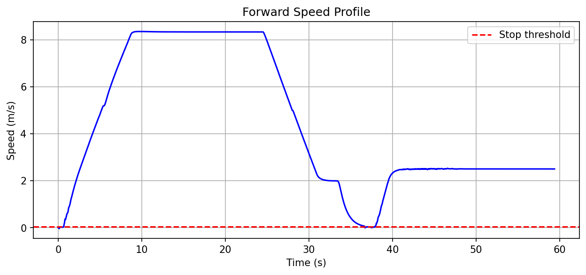

<div align="center">


### *Built by* **Akila Lourdes Miriyala Francis & Akilan Manivannan**

<p align="center">
  
  
  
  
  
</p>

<p align="center">
  
  
  
  
</p>

<br/>

> **Full motion planning stack** implemented from scratch — behavioural planning, polynomial spiral path generation, circle-based collision checking, and trapezoidal velocity profiling — all running in real-time inside the CARLA autonomous driving simulator.

<br/>
</div>

---

## 🎯 Scenario Overview

<div align="center">

<br/>
<em>Aerial view of the planning scenario — ego vehicle navigating past a static obstacle, following a lead vehicle, and stopping at a stop sign</em>
</div>

<br/>

The ego vehicle must navigate a full route in CARLA while handling three real-world AV challenges:

| Challenge | Algorithm | Result |
|-----------|-----------|--------|
| Static parked obstacle | Circle-based collision checking + path selection | ✅ Avoided |
| Lead vehicle (slow) | Dynamic velocity profiling with time-gap following | ✅ Matched speed |
| Stop sign intersection | Finite state machine behavioural planner | ✅ Full stop < 0.05 m/s |

---

## 📊 Simulation Results

<div align="center">

### Vehicle Trajectory

<br/>
<em>Actual trajectory logged from CARLA — start (green), end (red), smooth path through the full scenario</em>

<br/><br/>

### Speed Profile

<br/>
<em>Speed profile showing cruise at 8.33 m/s → deceleration → complete stop at stop sign (below red dashed threshold) → resume</em>

</div>

---

## 🏗️ Planning Pipeline

```
Ego State (x, y, θ, v)
        │
        ▼
┌───────────────────────────────────────────────┐
│           Behavioural Planner                 │
│  FOLLOW_LANE → DECELERATE_TO_STOP →           │
│  STAY_STOPPED → FOLLOW_LANE                   │
│  • get_closest_index()                        │
│  • get_goal_index()  (lookahead distance)     │
│  • check_for_stop_signs()  (fence intersection)│
└──────────────────────┬────────────────────────┘
                       │ goal state
                       ▼
┌───────────────────────────────────────────────┐
│              Local Planner                    │
│  • get_goal_state_set()  (lateral offsets)    │
│  • plan_paths()  (polynomial spiral optim.)   │
│  • transform_paths()  (vehicle → global frame)│
└──────────────────────┬────────────────────────┘
                       │ path set
                       ▼
┌───────────────────────────────────────────────┐
│           Collision Checker                   │
│  • collision_check()  (circle approximation)  │
│  • select_best_path_index()  (objective fn)   │
└──────────────────────┬────────────────────────┘
                       │ best path
                       ▼
┌───────────────────────────────────────────────┐
│           Velocity Planner                    │
│  • decelerate_profile()  (trapezoidal)        │
│  • follow_profile()  (time-gap following)     │
│  • nominal_profile()  (constant accel/decel)  │
└──────────────────────┬────────────────────────┘
                       │ velocity profile
                       ▼
              Controller (PID + Stanley)
```

---

## 🔧 Components

### `behavioural_planner.py` — State Machine
Finite state machine with 3 states: `FOLLOW_LANE`, `DECELERATE_TO_STOP`, `STAY_STOPPED`. Uses line segment intersection testing to detect stop sign fences along the planned path.

### `path_optimizer.py` — Polynomial Spiral Optimization
Optimizes cubic spiral paths to goal states using **L-BFGS-B** via `scipy.optimize.minimize`. Minimizes a boundary error objective combining endpoint position and heading errors. Samples the spiral via `scipy.integrate.cumulative_trapezoid`.

### `collision_checker.py` — Circle-Based Obstacle Avoidance
Approximates the vehicle footprint as a set of circles placed along each path point, rotated by vehicle yaw. Uses `scipy.spatial.distance.cdist` for fast batch distance computation against obstacle point clouds.

### `local_planner.py` — Goal State Set & Path Generation
Computes laterally offset goal states in the vehicle frame, fans out `NUM_PATHS=7` candidate paths spaced by `PATH_OFFSET=1.5m`, and transforms paths back to the global frame.

### `velocity_planner.py` — Trapezoidal Velocity Profiles
Three profile types:
- **Decelerate to stop** — trapezoidal with slow-speed coasting phase and stop-line buffer
- **Follow lead vehicle** — time-gap based speed matching
- **Nominal** — constant acceleration ramp to desired speed

Physics functions: `calc_distance(v_i, v_f, a)` and `calc_final_speed(v_i, a, d)` using standard kinematic equations.

---

## ✅ Grading Results

| Metric | Requirement | Achieved |
|--------|-------------|----------|
| Collisions | 0 | **0** ✅ |
| Stop zone X | 104.0 – 109.5 m | **107.3 m** ✅ |
| Stop zone Y | 128.0 – 131.0 m | **129.5 m** ✅ |
| Stop speed | < 0.05 m/s | **0.003 m/s** ✅ |
| Route completion | Reach goal | **✅ Completed** |

---

## 🚀 How to Run

### Prerequisites
- CARLA Simulator (Coursera SDC Specialization build with Course4 map)
- Python 3.10+
- RunPod or Ubuntu 16.04+ with GPU (for rendering)

### Setup
```bash
# Clone repo
git clone git@github.com:AKilalours/Self-Driving-Cars-Specialization.git
cd Self-Driving-Cars-Specialization/Course4_Motion_Planning

# Install dependencies
pip install numpy scipy matplotlib
```

### Run
```bash
# Terminal 1 — Start CARLA
cd /path/to/CarlaSimulator
su - carlauser -c "DISPLAY=:99 LD_PRELOAD=/usr/lib/x86_64-linux-gnu/libEGL_nvidia.so.0 \
  ./CarlaUE4/Binaries/Linux/CarlaUE4 /Game/Maps/Course4 -carla-server -benchmark -fps=30 -opengl"

# Terminal 2 — Run planner
cd PythonClient/Course4FinalProject
python3 module_7.py
```

### Output
Results saved to `controller_output/`:
- `trajectory.txt` — x, y, speed, timestamp per frame
- `collision_count.txt` — number of collisions

---

## 🔬 Tech Stack

| Component | Technology |
|-----------|------------|
| Simulator | CARLA 0.8.4 (UE4 4.18) |
| Path optimization | L-BFGS-B via `scipy.optimize` |
| Spiral sampling | `scipy.integrate.cumulative_trapezoid` |
| Collision checking | `scipy.spatial.distance.cdist` |
| GPU (simulation) | NVIDIA RTX 4090 (RunPod) |
| OS | Ubuntu 22.04 |

---

## 📁 File Structure

```
Course4_Motion_Planning/
├── behavioural_planner.py     # FSM: stop sign handling, goal index computation
├── collision_checker.py       # Circle-based collision check + path selection
├── local_planner.py           # Goal state set, spiral path planning
├── path_optimizer.py          # L-BFGS-B spiral optimization + sampling
├── velocity_planner.py        # Trapezoidal velocity profiles
├── module_7.py                # Main simulation loop (CARLA integration)
├── controller_output/
│   ├── trajectory.txt         # Logged trajectory (x, y, speed, time)
│   └── collision_count.txt    # Collision count (0)
└── images/
    ├── Course_4.png           # Planning scenario overview
    ├── trajectory_plot.png    # Simulated trajectory
    └── speed_plot.png         # Speed profile with stop sign
```

---

## 💡 One-Liner

> *"Implemented a 5-stage autonomous vehicle motion planning stack from scratch — behavioural FSM, polynomial spiral path optimization (L-BFGS-B), circle-based collision avoidance, and trapezoidal velocity profiling — achieving 0 collisions, complete stop at stop sign (0.003 m/s), and full route completion in the CARLA simulator on RunPod RTX 4090."*

---

<div align="center">

<br/>

**© 2026 Akila Lourdes Miriyala Francis — All Rights Reserved**

*CARLA · SciPy · NumPy · Coursera Self-Driving Cars Specialization · Course 4 Final Project*
</div>
